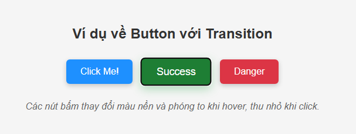
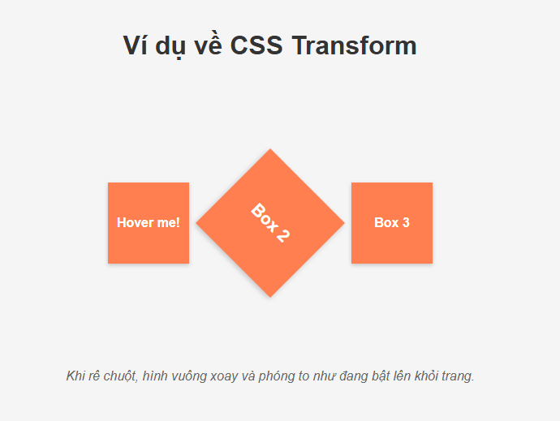
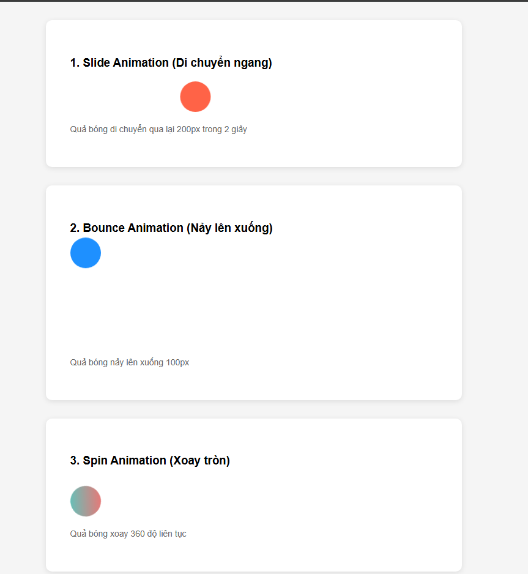

## Phần 1: Hiểu CSS và cách tích hợp

### 1. CSS là gì ?
**CSS (Cascading Style Sheets)** là ngôn ngữ để **định kiểu và trình bày giao diện** cho trang web.
Nếu **HTML** xây dựng phần khung (nội dung, cấu trúc), thì **CSS** làm đẹp phần nhìn -  như chọn màu, font chữ, hiệu ứng, vv


**Vai trò của CSS**
- Giúp trang web đồng nhất và dễ bảo trì.
- Tách riêng phần nội dung (HTML) và phần giao diện (CSS).
- Tăng tốc độ tải trang (chỉ cần tải 1 file CSS dùng cho nhiều trang).

### Các cách tích hợp CSS:
1. **Inline CSS** - viết trực tiếp trong thẻ HTML:
    ```html
    <p style="color: blue; font-size: 18px;">Đây là đoạn văn màu xanh.</p>
    ```
2. **Internal CSS** - viết trong thẻ `<style>` nằm bên trong `<head>`:
    ```html
    <style>
        p{
            color: green;
        }
    </style>
    ```
3. **External CSS (Khuyến khích)** - tách ra một file `.css` riêng và liên kết qua thẻ `<link>`
    ```html
   <link rel="stylesheet" href="style.css">
   ```
   *Ưu điểm:* Dễ bảo trì, tái sử dụng nhiều trang, chuyên nghiệp.

### Cú pháp cơ bản CSS
```css
selector {
  property: value;
}
```
Ví dụ:

```css
p {
  color: red;
  font-size: 16px;
}
```

**Selector** là phần tử HTML cần định dạng, **propery** là thuộc tính, **value** là giá trị.


## 2. CSS Selectors

- **Element selector:** `h1`, `p`, `div`  
  → Áp dụng style cho các phần tử HTML theo tên thẻ.  

- **Class selector:** `.class-name`  
  → Áp dụng cho các phần tử có class cụ thể.  

- **ID selector:** `#id-name`  
  → Áp dụng cho phần tử có id cụ thể (mỗi id nên là duy nhất).  

- **Descendant selector:** `div p`  
  → Chọn các phần tử `<p>` nằm bên trong `<div>`.  

- **Grouping selector:** `h1, h2, h3`  
  → Áp dụng cùng style cho nhiều phần tử cùng lúc.

---
## Phần 2: Styling cơ bản

### Typography - Kiểu chữ:

```css
body {
font-family: 'Arial', sans-serif;
font-size: 16px;
font-weight: bold;
color: #333;
text-align: center;
line-height: 1.5;
}
```

Giải thích:

`font-family`: chọn font chữ.

`font-size`: kích thước chữ.

`font-weight`: độ đậm.

`color`: màu chữ.

`text-align`: căn giữa, trái hoặc phải.

`line-height`: khoảng cách giữa các dòng.

### Background and Colors:

```css
body {
  background-color: #f0f0f0;
  background-image: url('bg.jpg');
  background-size: cover;
  background-position: center;
  background-repeat: no-repeat;
}
```

Giải thích:

`background-color`: màu nền

`background-image`: hình nền

`background-size`: điều chỉnh kích thước (cover = phủ toàn bộ)

`background-position`: canh vị trí hình

`background-repeat`: có lặp lại hay không

### Box Model

Trong CSS, **mọi phần tử HTML đều được coi là một “hộp” (box)**.  
Mô hình hộp gồm **4 lớp chính**, từ trong ra ngoài:

1. **Content** – Nội dung bên trong phần tử (chữ, hình, v.v.)  
2. **Padding** – Khoảng cách từ nội dung đến viền (bên trong phần tử)  
3. **Border** – Đường viền bao quanh phần tử  
4. **Margin** – Khoảng cách giữa phần tử và phần tử khác (bên ngoài)

Hình ảnh minh hoạ:


---

#### Ví dụ minh họa:
```css
.box {
  width: 200px;
  height: 100px;
  background-color: lightblue;
  padding: 20px;         
  border: 5px solid blue;
  margin: 30px;           
}
```

Khi hiển thị, **kích thước thực tế** của phần tử không chỉ là `width` và `height`.

Nó được tính theo công thức là:

- **Tổng chiều rộng** = width + padding trái/phải + border trái/phải + margin trái/phải

- **Tổng chiều cao**  = height + padding trên/dưới + border trên/dưới + margin trên/dưới

---
## Phần 3: Layout và Positioning

### 1. Display Property

**Display** quyết định cách một phần tử HTML được hiển thị trong trang web.  
Đây là nền tảng để hiểu bố cục của mọi trang web.

| Giá trị | Mô tả |
|----------|--------|
| `block` | Phần tử hiển thị như **khối** — chiếm toàn bộ chiều ngang (ví dụ: `<div>`, `<p>`, `<h1>`). |
| `inline` | Hiển thị **nội tuyến**, không xuống dòng — chỉ chiếm không gian vừa đủ (ví dụ: `<span>`, `<a>`). |
| `inline-block` | Kết hợp ưu điểm của block và inline: nằm cùng dòng nhưng có thể đặt `width` và `height`. |
| `none` | Ẩn phần tử khỏi trang, không chiếm không gian hiển thị. |

**Ví dụ:**
```html
<p>Đây là đoạn <span style="display: inline-block; width:100px; background:lightblue;">inline-block</span> trong dòng.</p>
```

### 2. Positioning

Thuộc tính `position` cho phép ta **điều khiển chính xác vị trí** của phần tử trong trang:

| Giá trị | Mô tả |
|---------| ------|
| `static` | Giá trị mặc định - Phần tử tuân theo luồng bình thường của tài liệu.|
| `relative`| Dịch chuyển **tương đối** so với vị trí ban đầu bằng `top`, `left`, `right`, `bottom`.|
|`absolute`| Định vị **tuyệt đối** so với phần tử cha gần nhất có `position = relative`.|
|`fixed`| Cố định phần tử theo **theo cửa sổ trình duyệt**, không di chuyển khi cuộn trang.|

**Ví dụ**:

```html
<div class="container">
    <div class="box1">Static</div>
    <div class="box2">Relative</div>
    <div class="box3">Absolute</div>
    <div class="box4">Fixed</div>
</div>
```

```css
.container {
position: relative;
height: 200px;
background: #eee;
}

.box1 {
position: static;
}

.box2 {
position: relative;
top: 20px;
left: 30px;
background: lightblue;
}

.box3 {
position: absolute;
top: 10px;
right: 10px;
background: lightgreen;
}

.box4 {
position: fixed;
bottom: 10px;
right: 10px;
background: tomato;
color: white;
padding: 10px;
}
```

### 3. Flexbox Layout

**Flexbox (Flexible Box Layout)** là hệ thống bố cục mạnh mẽ giúp căn chỉnh và phân phối phần tử dễ dàng hơn, đặc biệt khi làm responsive.

**Khai báo:**

```css
.container {
  display: flex;
}
```

→ Khi đó, `.container` trở thành **flex container**, còn các phần tử con là **flex items**.

**Thuộc tính của Flex Container:**

| Giá trị | Mô tả |
|---------| ------|
| `flex-direction` | Quy định hướng sắp xếp các item: `row` (ngang), `column` (dọc).|
| `justify-content`| Căn chỉnh các item theo trục chính (ngang khi `row`): `flex-start`, `center`, `space-between`, `space-around`.|
|`align-items`| Căn chỉnh các item theo trục phụ (dọc khi `row`): `flex-start`, `center`, `flex-end`, `stretch`.|
|`flex-wrap`| Cho phép xuống dòng khi không đủ chỗ (`wrap` hoặc `nowrap`).|

**Ví dụ**:

```html
<div class="container">
    <div class="item">Box 1</div>
    <div class="item">Box 2</div>
    <div class="item">Box 3</div>
</div>
```

```css
.container {
  display: flex;
  flex-direction: row;
  justify-content: space-around;
  align-items: center;
  flex-wrap: wrap;
  background: #f5f5f5;
  padding: 20px;
}
.item {
  background: lightcoral;
  padding: 20px;
  margin: 10px;
  border-radius: 8px;
  flex: 1;
  text-align: center;
}
```
**Thuộc tính của Flex Item:**

| Giá trị | Mô tả |
|---------| ------|
| `flex-grow` | Xác định mức độ phóng to khi có thêm không gian trống.|
| `flex-shrink`| Xác định mức độ co lại khi thiếu chỗ.|
|`flex-basis`| Đặt kích thước cơ bản ban đầu của item trước khi áp dụng grow/shrink.|

**Ví dụ**:
```css
.item1 { flex-grow: 1; }  
.item2 { flex-grow: 2; }   
.item3 { flex-basis: 200px; } 
```

**Chú ý:**
- Dùng `Display: flex` cho bố cục ngang, căn giữa, hoặc tạo layout responsive nhanh.
- Dùng `justify - content: center` và `align-items: center` để **căn giữa hoàn hảo cả ngang lẫn dọc**.


## Phần 4: Responsive Design

### 1. Khái niệm

**Responsive Design** (Thiết kế phản hồi linh hoạt) là kỹ thuật giúp giao diện web **tự điều chỉnh bố cục** tùy theo kích thước màn hình của thiết bị.  
Một trang web responsive sẽ hiển thị tốt trên **điện thoại, máy tính bảng, laptop và màn hình lớn** mà không cần tạo nhiều phiên bản riêng biệt.

---

### 2. Media Queries (Truy vấn phương tiện)

**Media Query** cho phép áp dụng CSS **có điều kiện**, dựa vào **kích thước màn hình, độ phân giải, hoặc thiết bị**.

Cú pháp:
```css
@media (điều_kiện) {
  /* CSS áp dụng khi điều kiện đúng */
}
```

**Ví dụ cơ bản:**
```css
/* Mặc định cho màn hình lớn */
body {
  background-color: white;
  font-size: 18px;
}

/* Khi màn hình nhỏ hơn hoặc bằng 768px → mobile */
@media screen and (max-width: 768px) {
  body {
    background-color: lightblue;
    font-size: 16px;
  }
}
```

Khi người dùng mở trang giao diện bằng điện thoại, nền sẽ đổi màu sang **xanh nhạt và chữ nhỏ hơn**. Khi xem lại trên máy tính, thì giao diện sẽ trở lại mặc định.


### 3. Các điểm dừng (Breakpoints) phổ biến:

Breakpoints là **ngưỡng màn hình** màn tại đó layout cần thay đổi để phụ hợp hơn.

| Kích thước | Thiết bị thường gặp | Gợi ý sử dụng |
|---------| ------| ----|
| `320px` | Điện thoại nhỏ | Điều chỉnh cỡ chữ ẩn bớt nội dung|
| `480px` | Điện thoại trung bình | Căn chỉnh lại cột, padding|
| `768px` | Máy tính bảng (tablet) | Bố cục 1–2 cột|
| `1024px` | Laptop nhỏ | Giãn đều nội dung|
| `1200px+` | Màn hình lớn / desktop | Dạng full layout|

**Ví dụ:**
```css
@media screen and (max-width: 1024px) {
  .container { width: 90%; }
}

@media screen and (max-width: 768px) {
  .container { flex-direction: column; }
}

@media screen and (max-width: 480px) {
  .nav { display: none; } /* Ẩn menu trên điện thoại nhỏ */
}
```

### 4. Responsive Units (Đơn vị tương đối):
Khi làm responsive, **tránh dùng các pixel cố định** 

| Kích thước | Thiết bị thường gặp | Gợi ý sử dụng | Ghi chú|
|---------| ------| ----|---|
| `px` |Pixel tuyệt đối | `100px`| Không linh hoạt|
| `%` |Tỷ lệ so với phần tử cha | `width: 50%`| Thay đổi theo kích thước khối chứa|
| `em` | Dựa trên `font-size` của phần tử cha | `2em` = gấp đôi kích thước chữ cha|
| `rem` | Dựa trên `font-size` của `html` | `1rem` = kích thước gốc toàn trang|
| `vw` | Tỷ lệ theo chiều rộng viewport | `50vw` = 50% chiều rộng màn hình|
| `vh` | Tỷ lệ theo chiều cao viewport | `100vh` = toàn chiều cao màn hình

**Ví dụ:**
```css
.container {
  width: 80%;
  padding: 2rem;
  font-size: 1.2em;
}
.hero {
  height: 100vh; /* toàn màn hình */
}
```

### 5. Mẹo thiết kế responsive (tham khảo chat GPT):
1. Thiết kế theo hướng **Mobile-First**
Bắt đầu từ màn hình nhỏ sau đó mở rộng dần `(min-width)` thay vì co lại `(max-width)`

```css
/* Bắt đầu với mobile */
.container {
  flex-direction: column;
}

/* Lên tablet và desktop */
@media (min-width: 768px) {
  .container {
    flex-direction: row;
  }
}
```
2. Sử dụng `box-sizing: border-box` để tránh lỗi tính toán kích thước.
3. Giữ font và khoảng cách linh hoạt bằng đơn vị `rem` và `%`.
4. Kiểm tra trên nhiều thiết bị thực tế hoặc dùng DevTools → Responsive mode.

### Kết luận:
Responsive Design là **trái tim của web hiện đại**.
Nhờ media queries, flexbox, và đơn vị linh hoạt, website có thể thích nghi mượt mà trên mọi thiết bị — giúp người dùng có trải nghiệm thống nhất dù họ dùng màn hình 5 inch hay 30 inch.

## Phần 5: CSS Effects & Animations

### 1. CSS Transitions (Hiệu ứng chuyển tiếp)

Transition giúp các thay đổi CSS **xảy ra mượt mà** thay vì đột ngột.  
Nó thường được dùng khi người dùng tương tác — ví dụ: di chuột, bấm nút, hay đổi trạng thái.

**Cú pháp:**
```css
transition: property duration timing-function delay;
```
`property` → thuộc tính muốn áp dụng hiệu ứng (vd: color, background, transform)

`duration` → thời gian hiệu ứng (vd: 0.5s, 300ms)

`timing-function` → tốc độ thay đổi (vd: ease, linear, ease-in-out)

`delay` → thời gian trễ trước khi bắt đầu (tùy chọn)

**Ví dụ:**
```css
button {
  background-color: #0077cc;
  color: white;
  padding: 12px 24px;
  border: none;
  border-radius: 6px;
  transition: background-color 0.3s ease, transform 0.2s ease-in-out;
}

button:hover {
  background-color: #005fa3;
  transform: scale(1.1);
}
```



### 2. CSS Transform (Biến đổi phần tử):
Transform cho phép **di chuyển, xoay, phóng to, nghiêng phần tử** mà không ảnh hưởng bố cục.

| Hàm | Mô tả | Ví dụ |
|---------| ------| ----|
| `translate(x, y)` | Di chuyển phần tử | `transform: translate(50px, 20px)`|
| `scale(x, y)` | Phóng to / thu nhỏ | `transform: scale(1.2)` |
| `rotate(angle)` | Xoay phần tử | `transform: rotate(45deg)`|
| `skew(x, y)` | Nghiêng phần tử | `transform: skew(15deg, 5deg)`|


**Ví dụ:**
```css
.box {
  width: 100px;
  height: 100px;
  background: coral;
  transition: transform 0.4s ease;
}

.box:hover {
  transform: rotate(45deg) scale(1.3);
}
```


### 3. CSS Animations:
Animations giúp tạo **chuyển động liên tục phức tạp** hơn transition — bạn có thể xác định từng giai đoạn trong chuỗi hiệu ứng.

Cú pháp:
```css
@keyframes ten-animation {
  from { /* trạng thái bắt đầu */ }
  to { /* trạng thái kết thúc */ }
}
```

Sau đó ta sử dụng vào phần tử:
```css
.element {
  animation-name: ten-animation;
  animation-duration: 2s;
  animation-iteration-count: infinite;
  animation-direction: alternate;
}
```

**Ví dụ:**
```css
@keyframes slide {
  from { transform: translateX(0); }
  to { transform: translateX(200px); }
}

.ball {
  width: 50px;
  height: 50px;
  border-radius: 50%;
  background: tomato;
  animation-name: slide;
  animation-duration: 2s;
  animation-iteration-count: infinite;
  animation-direction: alternate;
}

```


